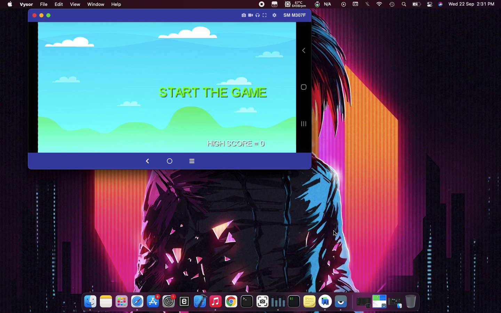

# Bird-game-usig-libGDX
This game is written in java using LibGDX that runs on android Os.
It uses the device's accelerometer and gyro sensors to move the plane up and down. you have to press on the screen to fire bullets from the aircraft

Here are some sample images of the game:-

